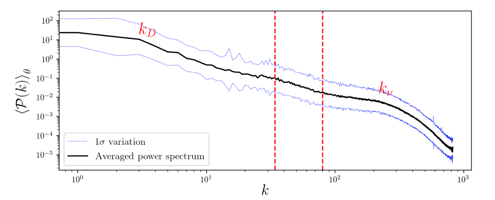
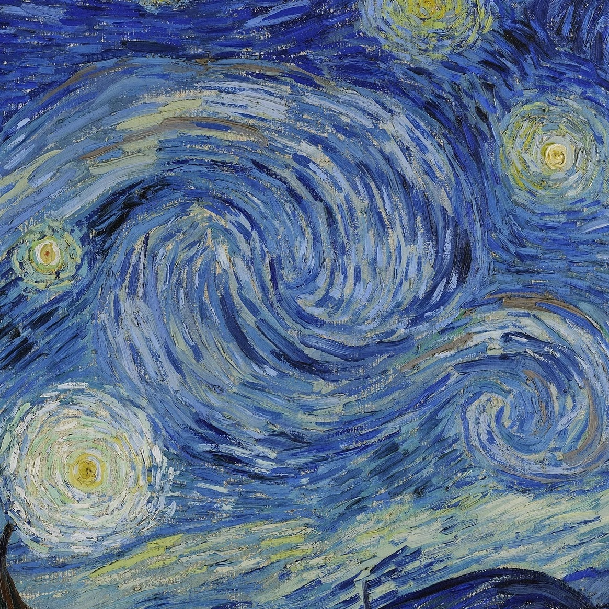
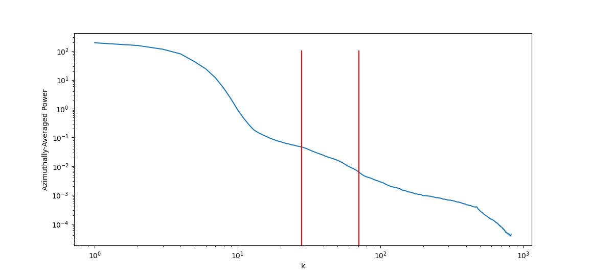

# Research Reproduction
The purpose of these scripts is to reproduce analysis previously completed in the paper *Is The Starry Night Turbulent?*[^1]. The purpose of this reproduction is to frame questions which will be interrogated in subsequent work. This work can be found in the [parent of this directory](../).

The key result of the paper is the following chart, which shows a 2D fourier transform applied to the Starry Night painting.

The chart shows two regions, one of low wave number and one of high wave number, connected by a linear region. The authors of the paper conclude that the painting thus characterises realistic turbulent flow.

## Method
The authors of the paper describe taking a close crop of the sky in the painting of *the Starry Night*.

After this, a 2D fourier transform is taken of the painting. A Gaussian filter is applied to smooth some variation in the spectrum. This is the azimuthally averaged to give the power spectrum plot.

This method was reproduced. First, a high-resolution image of the painting was cropped to a frame similar to the crop taken by the original authors.

After this, a 2D Fourier transform, Gaussian filter and azimuthal average was completed.
The only change made was to use a Gaussian filter with a standard deviation of three, rather than 10 pixels. This was done since the 10-pixel filter blurred the spectrum to an extent more significant than in the paper.

All code can be found in `main.py`.

## Results
The reproduced chart is shown below.

The reproduction was successful. A similar linear region was identified (although this was between $k$ values of 28 and 71, rather than 35 and 81 in the original paper). 

The gradient of this section was found to be -2.1, which is identical to the gradient found in the original paper.

## Adaption
Further analysis was conducted by destroying certain frequencies present in the painting. This is illustrated below. On the left is the image with some frequencies removed. On the right is the mask used on the fourier transform to only retain certain frequencies.

The thin line on the mask shows the radii at between which the linear region has been identified.

*You may need to refresh this page for the gif to play*

The first gif shows only the inclusion of low frequencies. It is interesting that the fluid nature of the painting appears to emerge even when only a few low frequencies are used. It seems that only the brushstrokes are refined with the final frequencies.

Here, when low frequencies are removed early on, the pattern of swirls begins to dissappear, leaving only the texture of the brushstroke.

All images used in these gifs may be found in `output/`.

[^1]:Is The Starry Night Turbulent? Beattie, James and Kriel, Neco